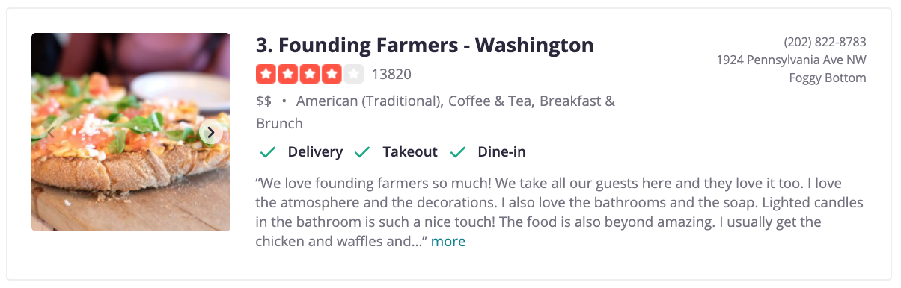
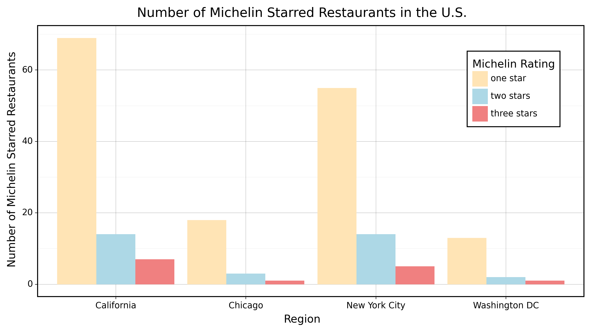
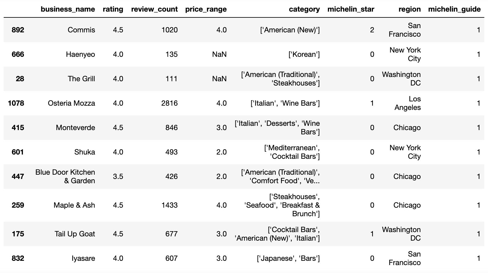
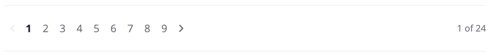

```{r setup, include=FALSE}
reticulate::use_python("/usr/local/bin/python3")
knitr::opts_chunk$set(echo = FALSE)
```


## Problem Statement

- What factors make it more or less likely for a restaurant
  - To be in the Michelin guide?
  - To get a Michelin star?


## Background

- <span style="font-weight:bold">Michelin</span>
  - French tire manufacturer
  - Introduced the star rating system
    - <span style="color:red">One Star:</span> high quality cooking, worth a stop
    - <span style="color:red">Two Stars:</span> excellent cuisine, worth a detour
    - <span style="color:red">Three Stars:</span> exceptional cuisine, worth a special journey
  - Only reviewed five cities in the U.S.
    - Washington, D.C.
    - Chicago
    - New York
    - San Francisco
    - Los Angeles


## Problem Statement

- What factors make it more or less likely for a restaurant
  - To be in the Michelin guide?
  - To get a Michelin star?
- Classification problem
  - Likelihood of being on the guide and get a star
- Predictors:
  - Yelp ratings and reviews
  - Cuisine of the restaurant
- Predicted outcomes:
  - 1 (in the guide) or 0 (not in the guide)
  - 1 (receive a star) or 0 (not receive a star)


## Methods

- Web Scraping
  - Yelp: rating, cuisine, price, reviews
  - Wikipedia: list of Michelin starred restaurants
  - Michelin Guide website
- Google Plaves API
  - Rating, menu, reviews, popular times
- Data Wrangling


## Methods

- Data Visualization
  - Bar graph
  - Pie chart
  - Map
- Machine Learning
  - What factors predict whether or not a restaurant will receive a star?
  - Which factor matters the most?


## Web Scraping {.build}

```{python echo=TRUE}
# Yelp DC restaurants url
DC_url = 'https://www.yelp.com/search?find_desc=Restaurants&find_loc=Washington%2C%20DC'
```

{width=70%}

```{python include=FALSE}
# Extract page urls
DC_urls = set([DC_url])
DC_page_no = 24
```

```{python echo=TRUE}
for i in range(10, DC_page_no*10, 10):
    DC_urls.update([DC_url+'&start='+str(i)])
list(DC_urls)[3]
```


## Web Scraping {.build}

```{python include=FALSE}
# Data processing
import pandas as pd
import numpy as np

# Scraping web content
import requests # For downloading the website
from bs4 import BeautifulSoup # For parsing the website
import time # To put the system to sleep
import random # For random numbers

# Ignore warnings
import warnings
warnings.filterwarnings('ignore')

# Build a scraper for Yelp links
def Yelp_scraper(url=None):
    """
    Scrape a Yelp url to extract business information.

    Args:
        url (str): string of a Yelp url.

    Returns:
        DataFrame: frame containing business information of the url.
    """
    # Download the webpage
    page = requests.get(url)

    # If a connection was reached
    if page.status_code == 200:

        # Parse
        soup = BeautifulSoup(page.content,'html.parser')

        # Create an empty DataFrame
        info = pd.DataFrame(columns=['business_name','rating','review_count','price_category'])

        for tag in soup.select('[class*=container]'):
            if tag.find('h4'):
                info = info.append({'business_name':tag.select('h4')[0].get_text(),
                                    'rating':tag.select('[class*=stars]')[0]['aria-label'],
                                    'review_count':tag.select('[class*=reviewCount]')[0].get_text(),
                                    'price_category':tag.select('[class*=priceCategory]')[0].get_text()},
                                   ignore_index=True)

    # Return data
    return info
```

```{python echo=TRUE}
Yelp_scraper(url=DC_url)
```


## Data Wrangling {.build}

```{python include=FALSE}
# Read in the data
DC_Yelp = pd.read_csv("../Data/Yelp/DC_Yelp_cleaned.csv")
DC_Wiki = pd.read_csv("../Data/Wikipedia/Wiki_DC.csv")
```

```{python echo=TRUE}
DC_YW = (pd.merge(left = DC_Yelp, right = DC_Wiki, how = "left",
                  left_on = "business_name", right_on="Name")
         .drop(list(DC_Wiki.columns)[:-1],axis=1)
         .rename(columns={"2020":"michelin_star"}))
```

```{python include=FALSE}
DC_YW['michelin_star'] = DC_YW.michelin_star.fillna(0)
DC_YW['michelin_star'] = DC_YW.michelin_star.replace('1 Michelin star',1)
DC_YW['michelin_star'] = DC_YW.michelin_star.replace('2 Michelin stars',2)
DC_YW['michelin_star'] = DC_YW.michelin_star.replace('3 Michelin stars',3)
DC_YW['region'] = 'Washington DC'
```

```{python include=TRUE}
DC_YW[['business_name','rating','review_count','michelin_star']].head()
```

```{python include=FALSE}
DC_YW = DC_YW[['business_name','rating','review_count','michelin_star']]
```

```{python echo=TRUE}
DC_YW.query('michelin_star != 0')
```


## Preliminary Results {.build}

{width=80%}


## Preliminary Results {.build}

{width=80%}


## Challenges {.build}

```{python include=FALSE}
# Read in the data
dat = pd.read_csv("../Data/Merged_Data.csv")
dat['price_range'] = dat.price_range.replace('$$$$',4)
dat['price_range'] = dat.price_range.replace('$$$',3)
dat['price_range'] = dat.price_range.replace('$$',2)
dat['price_range'] = dat.price_range.replace('$',1)
```

```{python echo=TRUE}
len(dat.query('michelin_star != 0').index)
```

```{python echo=TRUE}
len(dat.query('michelin_guide == 1').index)
```

```{python include=FALSE}
# Read in the Michelin data
Michelin = pd.read_csv("../Data/Michelin/Michelin.csv")
```

```{python echo=TRUE}
len(Michelin.index)
```


## Challenges {.build}

{width=80%}

{width=80%}

## Challenges {.build}

- Data is limited in scope
- Expand the set of predictors
  - Scrape Yelp reviews
  - Google Places API
