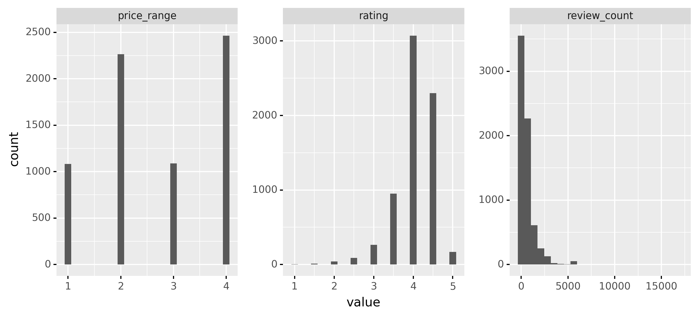
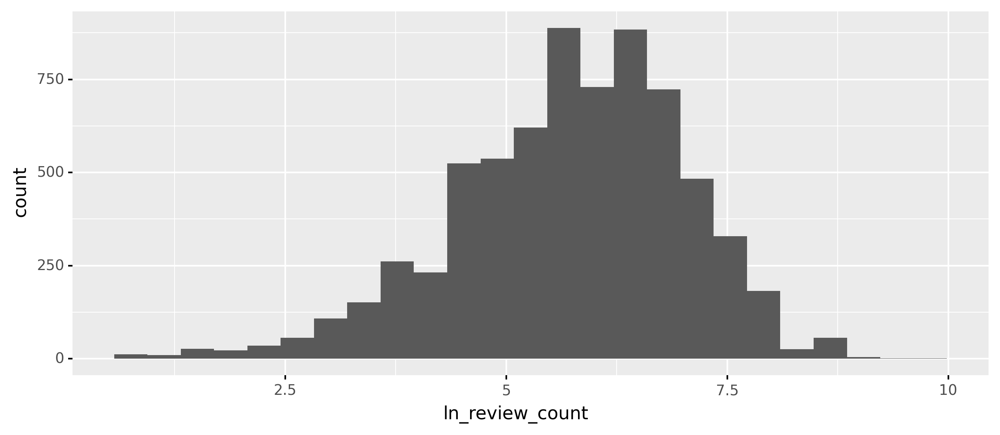
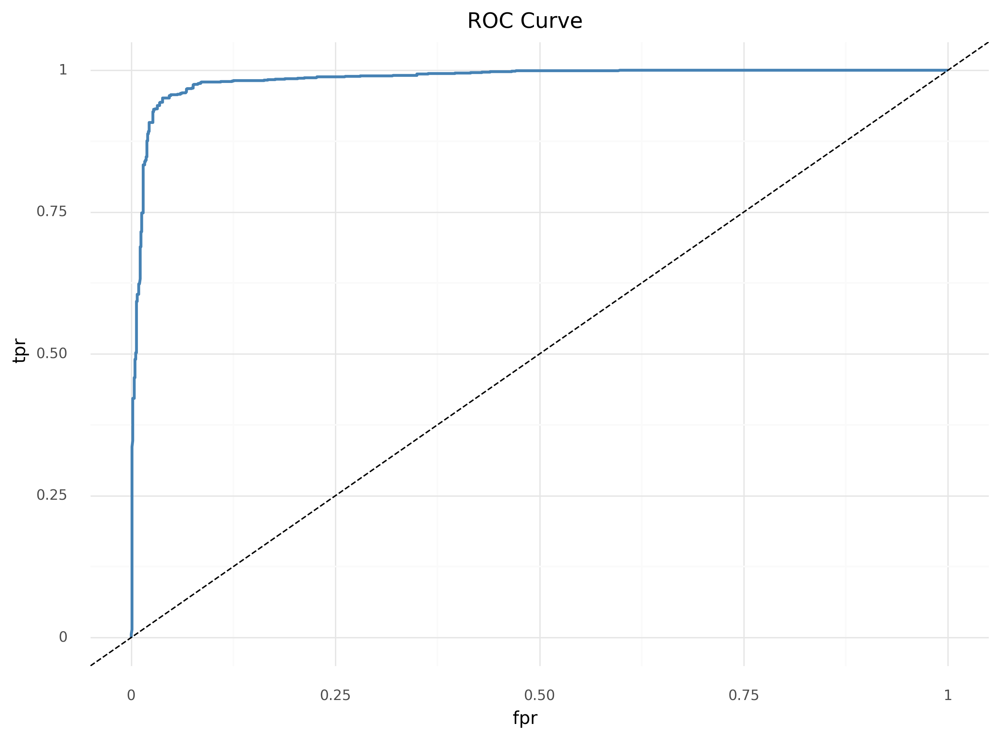
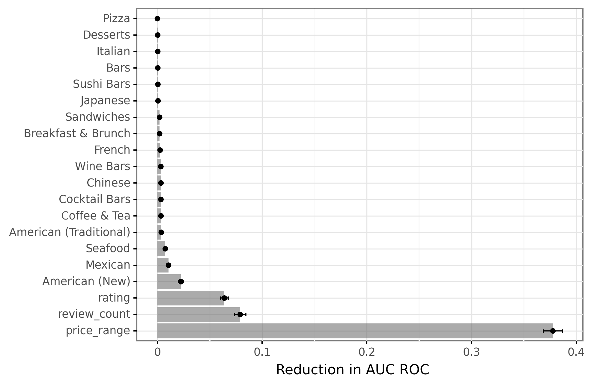
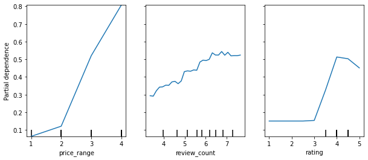
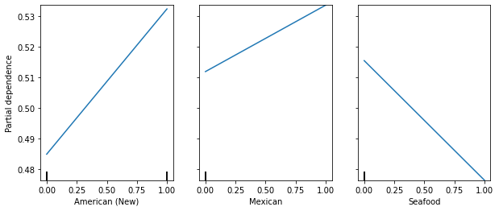
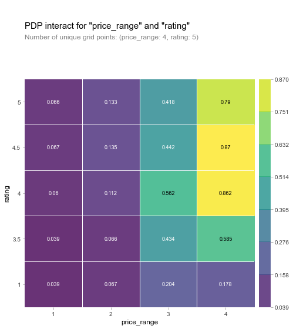
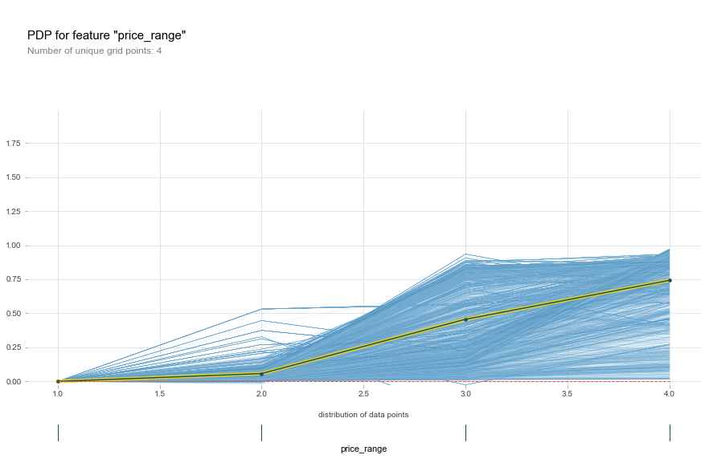

## Introduction

This project aims to explore factors associated with earning a Michelin star. This report is divided into five parts. The first part introduces a clear problem statement and some background on the Michelin star. The second part outlines the data sources and the related process of data wrangling. The third part illustrates the methods and tools used for data analysis. The fourth part presents the results. Finally, the report concludes with an evaluation of the project.

## Problem Statement and Background

It seems utterly strange to link tires with food, but Michelin does a great job on this task. Michelin, a French tire manufacturing company, is the second-largest tire manufacturer in the world, ranked only after Bridgestone. In the 1900s, Michelin launched its first guidebook to encourage road tripping in France and introduced the star rating system for fine dining restaurants.[^1] It awards up to three stars to a select few restaurants in the world. The star ratings are defined as follows:

[^1]: McConnell, A. (2020, March 25). How Michelin Stars Are Awarded to Restaurants. TripSavvy. https://www.tripsavvy.com/about-michelin-stars-1329159.

- One star: The restaurant is considered very good in its category and worth a stop.
- Two stars: The restaurant delivers excellent cuisine and is worth a detour.
- Three stars: The restaurant has exceptional cuisine and is worth a special journey.

To this day, Michelin relies entirely on its full-time staff of anonymous reviewers to discuss which restaurants will be awarded stars. In this way, the Michelin stars are very different from Yelp ratings, which rely on consumer feedback. It also takes longer for the staff to review restaurants around the world. In the United States, Michelin has only reviewed restaurants in Washington, D.C., New York, Chicago, San Francisco, and Los Angeles. In 2019, the guidebooks of the latter two cities merged into one for the entire state of California.

This project aims to explore factors associated with earning a Michelin star. To be specific, this project tries to answer the following question: What factors make it more or less likely for a restaurant to earn a Michelin star? The goal is to build a classifier to predict whether a restaurant will be awarded a Michelin star using data collected from Yelp.

## Data

The data set for this project originates from the following sources:

- Wikipedia: There are pages for lists of Michelin starred restaurants in Washington, D.C.[^2], New York[^3], Chicago[^4], San Francisco[^5], and Los Angeles[^6], each contains a table of Michelin starred restaurants and their star ratings since first awarded.

[^2]: List of Michelin starred restaurants in Washington, D.C. Wikipedia. (2020, October 23). https://en.wikipedia.org/wiki/List_of_Michelin_starred_restaurants_in_Washington,_D.C.
[^3]: List of Michelin starred restaurants in New York City. Wikipedia. (2020, November 30). https://en.wikipedia.org/wiki/List_of_Michelin_starred_restaurants_in_New_York_City.
[^4]: List of Michelin starred restaurants in Chicago. Wikipedia. (2020, October 23). https://en.wikipedia.org/wiki/List_of_Michelin_starred_restaurants_in_Chicago.
[^5]: List of Michelin starred restaurants in San Francisco Bay Area. Wikipedia. (2020, November 25). https://en.wikipedia.org/wiki/List_of_Michelin_starred_restaurants_in_San_Francisco_Bay_Area.
[^6]: List of Michelin starred restaurants in Los Angeles. Wikipedia. (2020, November 30). https://en.wikipedia.org/wiki/List_of_Michelin_starred_restaurants_in_Los_Angeles.

- Michelin Guide Website[^7]: The website contains a directory for the most recent Michelin starred restaurants. It also displays the Michelin recommended restaurants.

[^7]: MICHELIN Guide United States – the official website. MICHELIN Guide. https://guide.michelin.com/us/en.

- Kaggle: A dataset called Michelin Restaurants[^8] contains ratings, cuisine, and geographic information about Michelin restaurants worldwide. The dataset was lastly updated a year ago, so it does not include the 2020 ratings.

[^8]: JackyWang. (2019, July 28). Michelin Restaurants. Kaggle. https://www.kaggle.com/jackywang529/michelin-restaurants. 

- Yelp: Almost all starred restaurants have already been added on Yelp, including information on phone, address, neighborhood, rating, review count, price range, and cuisine category.

The unit of observation is each restaurant. The dependent variable of interest is a dummy variable for Michelin star, with 1 indicating the restaurant earned a Michelin star and 0 not earned. The independent variables of interest are rating, review count, price range, and some dummy variables for cuisine category.

To obtain the data, I used Beautiful Soup to scrape Wikipedia pages and the Michelin Guide website. From the Kaggle website, I downloaded the Michelin Restaurant dataset in CSV format and subset the data to only include Michelin starred restaurants in the United States. Since Yelp has a much more complicated format and contains most of my independent variables, I used ParseHub, a web scraping tool, to extract necessary information.

The data from Wikipedia and the Michelin Guide website is relatively clean. The Yelp data, however, causes numerous issues. First, when searching for restaurants in, for example, New York, Yelp only displays ten restaurants per page. I had to loop through all available page numbers to create a set of Yelp links for scraping. Then, I noticed that Yelp only presents a maximum of 24 pages for a single search, meaning 240 restaurants. This is definitely not the number of restaurants existing in New York. Therefore, instead of entering New York into the search box, I searched with a sample of 5-digit zip codes for New York. In this way, I was able to collect 240 restaurants' information for every zip code. I later merged all the data and dropped the duplicates to get a complete list of restaurants in the five cities. However, some businesses were missing information on neighborhood and price range, probably due to a lack of consumer reviews.

For the data wrangling process, I used pandas[^9] to split the price and category variable into two separate columns. Besides, I replaced the dollar sign ($) in the price variable with integers from 1 to 4, indicating the count of dollar signs. Next, I merged Wikipedia and the Michelin Guide website data onto the Yelp data by restaurant name. Since the spelling varies across different sources, I transformed restaurant names to lower case for a better match result. Besides, I used anti merge to check for Michelin starred restaurants that did not find the match, and I manually paired up the unmatched ones. I performed the data wrangling process for each state and row bind the information into one single dataset.

[^9]: Data structures for statistical computing in python. In Proceedings of the 9th Python in Science Conference (Vol. 445, pp. 51–56).

In the merged dataset, the cuisine category was stored as lists. For example, the category for Unconventional Diner is ['American (New)', 'Breakfast & Brunch']. I decided to separate this list and create two dummy variables for American (New) and Breakfast & Brunch. By splitting the entire category column, I created 350 dummy variables of various cuisine types. However, I then realized some shops and tourist locations got mixed into the dataset while scraping. I dropped those businesses and the corresponding categorical dummies. The final data set include information on 9,365 businesses in Washington, D.C., New York, Chicago, San Francisco, and Los Angeles, with 186 dummy variables of different cuisine types.

## Analysis

Data must be preprocessed in order to be used in Machine Learning algorithms. This preprocessing phase includes cleaning, formatting and restructuring of the data. Since earning a Michelin star is relatively rare, 9,258 restaurants in the final dataset do not have a star, and only 157 restaurants have a star. If I just constructed a model that always predicts "no stars," this solution would have $9,285 \div 9,365 = 99.15\%$ accuracy. This accuracy is misleading because for restaurants with a Michelin star, I would have $0\%$ accuracy. To deal with the imbalanced dataset, I down-sampled the majority class (not starred) and up-sample the minority class (starred). I utilized a mixture of the two methods because there was a vast difference between the two classes. Specifically, I down-sampled the majority class to 4,600 observations by randomly removing observations to prevent its signal from dominating the learning algorithm. Also, I up-sampled the minority class to the same amount by randomly duplicating observations from the minority class to reinforce its signal. I combined the down-sampled majority class with the up-sampled minority class.

Then, I used the sklearn package[^10] to split the data into a training and test dataset, partitioning 75% of the data into the training data and holding out 25% of the data as a test set. I plotted the continuous variables to explore their distributions.

[^10]: Scikit-learn: Machine Learning in Python, Pedregosa et al., JMLR 12, pp. 2825-2830, 2011.

The review count variable has a right-skewed distribution. When the variable is not normally distributed, the algorithm will not deliver the best performance due to a larger variance across observations. Therefore, I log-transformed the review count variable to decrease the variability of data.

Next, I decided to drop unnecessary dummy variables. For some of the variables, such as Polynesian and Nicaraguan, there is very little representation in the data. I calculated the number of occurrences for each dummy variable and dropped the ones with the occurrence of fewer than 300 times. This step helped to decrease the total number of features available and increase the speed of the machine learning process.

I built a machine learning pipeline that would re-split the transformed data, pre-process the data, use K-fold cross-validation with five folds, and incorporate the following models:
- Naive Bayes Classifier
- K-nearest Neighbors Classifier: The model is tuned for different numbers of nearest neighbors.
- Decision Tree Classifier: The model is tuned for different maximum tree depth sizes.
- Random Forest Classifier: The model is tuned for different maximum tree depth sizes, different numbers of trees grown, and different numbers of variables selected when building each tree.

## Results

The random forest model with the following tuning parameters performed the best:
- Maximum tree depth size = 9
- Number of trees grown = 750
- Number of variables selected when building each tree = 7

Since the data set was initially imbalanced, I used a balanced accuracy score to deal with the problem. The balanced accuracy score for the training data is 0.964, and the balanced accuracy score for the test data is 0.947, indicating that the model predicts the right class at about 94.7% chance.

The AUC measures how true positive rate and false positive rate trade off. The AUC for the training data is 0.995, and the AUC for the test data is 0.985, suggesting that the model performance is pretty good.

An important task when performing supervised learning is to determine which features provide the most predictive power. This project aims to identify factors that most strongly predict whether a restaurant will receive a Michelin star. I examined the variable importance within the sklearn framework.

Based on Figure 4, we can see that the model relies on price range, review count, and rating the most when making predictions. Particularly, the price range matters a lot more than the other variables. This suggests that a restaurant has to be expensive to become a Michelin starred restaurant. Figure 4 also indicates that American (New), Mexican, and seafood cuisines are related to earning a Michelin star.

As shown in Figure 5, The most considerable differences can be seen in the price range. If the restaurant charges a higher price, the probability of earning a Michelin star is higher. Also, restaurants with more reviews on Yelp are more likely to get a Michelin star. The higher the Yelp rating, the higher the probability of getting a star. This trend goes up to around Yelp rating equals 4, then flattens and drops a little.

According Figure 6, The probability of earning a Michelin star is higher for restaurants with American (New) and Mexican cuisine, but not seafood.

{height=40%}

{height=60%}

Figure 7 shows the increase in the probability of earning a Michelin star when the restaurant has a high Yelp rating and charges a high price. When the price range is high, restaurants with a rating of 4.0 or 4.5 have a higher chance of getting a star than restaurants with a rating of 5.0.

The ICE plot for the most important variable in Figure 8 illustrates that there is heterogeneity in the marginal effect across observations. Each line represents one restaurant. For most restaurants, there is an increase in predicted probability of earning a Michelin star with increasing price range.

## Discussion

This project aims to explore factors associated with earning a Michelin star. The model successfully predicts the likelihood of whether a restaurant will receive a Michelin star. The result further suggests that to become a Michelin starred restaurant, one should charge a high price, accumulate many reviews from consumers, maintain a Yelp rating of over 4.0, and probably serve new American cuisine.

Besides, this project produces a clean dataset that easily allows people to search for a Michelin restaurant and its Yelp rating. Based on my experience, I noticed a vast Yelp rating difference among one-starred restaurants. If I ever wanted to go to a one-starred restaurant with a high Yelp rating, I have to copy and paste each one-starred restaurant name into Yelp, search for the rating, and compare all the ratings to find the highest one. The process was too complicated and time-consuming, especially when you have a connection problem with Yelp. Therefore, I think a clean dataset will be extremely beneficial to food lovers in the United States.

If I was given more time, I would expand the analysis to include ratings and customer flow from Google maps. I would also do another machine learning process to determine what factors are associated with being on the Michelin guide without receiving a star.